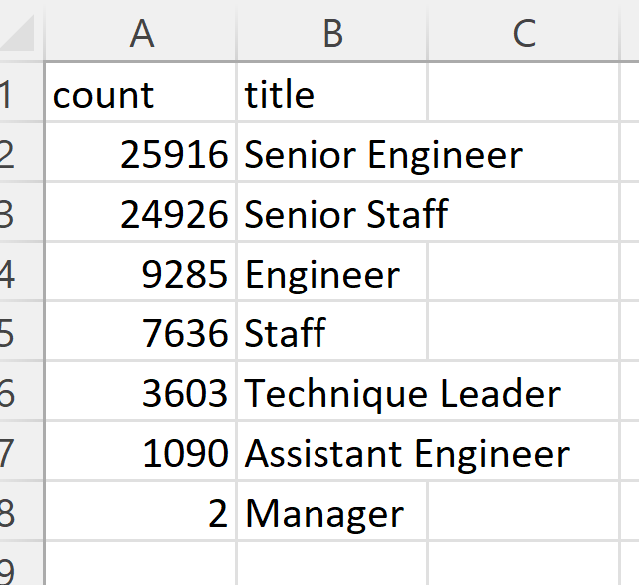
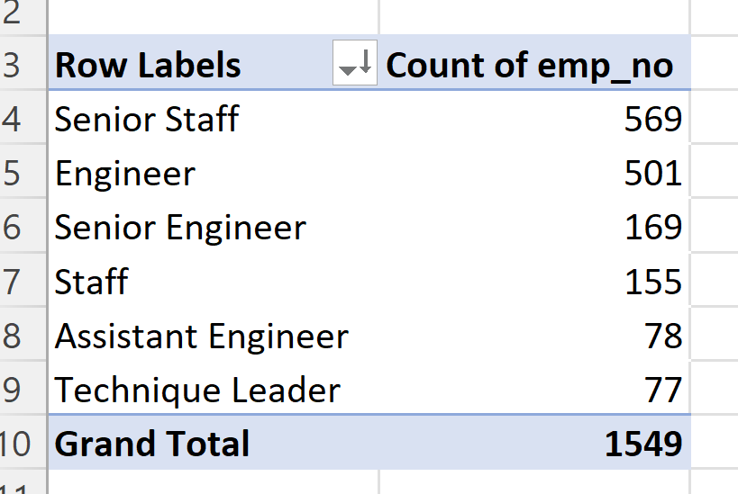
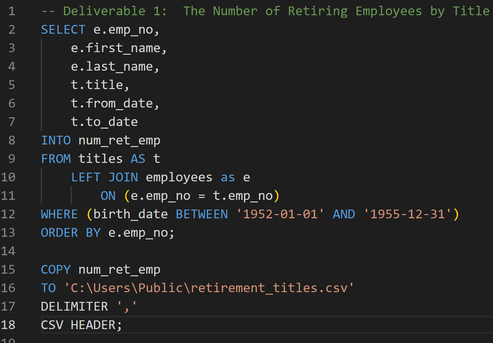
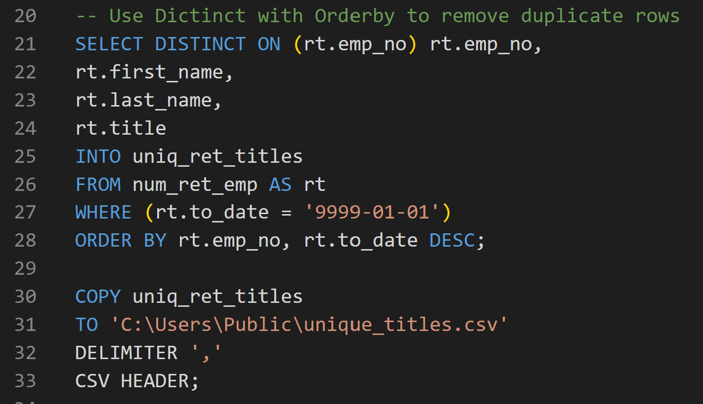
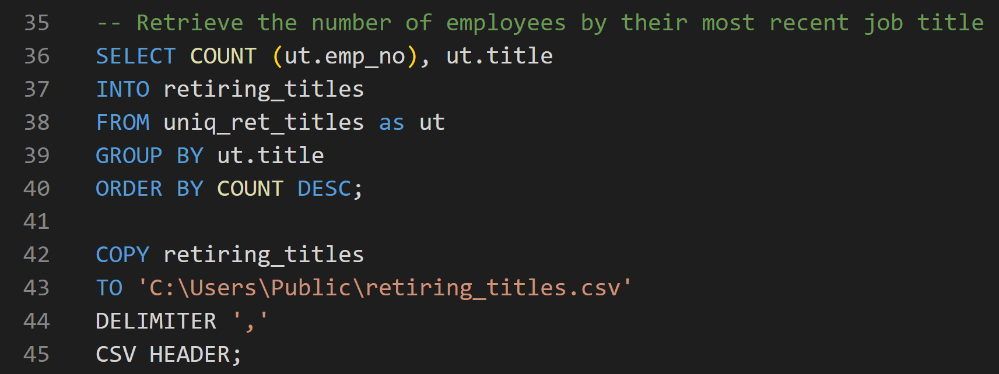
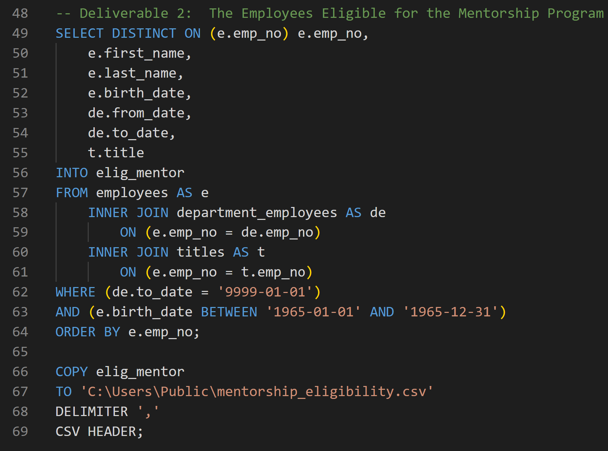

# Pewlett Hackard Analysis

## Overview of Pewlett Hackard Analysis

Pewlett Hackard, a ficticious company, is preparing for the expected wave of retirements across its workforce.  Bobby, an up-and-comming human resources analyst, was tasked to perform employee research.  He was to provide a list of the people expected to retire.  This task intends to future-proof Pewlett Hackard by allowing them to plan for the eligible employees' retirement packages.  

To accomplish this task, we will help Bobby build a SQL database from six comma separated value Excel files.  We will then query that database to generate the requested lists.  
 
### Resources

* Resources:  six employee csv files
* Software:  PostgreSQL, Visual Studio Code, 1.38.1

## Pewlett Hackard Analysis Results

### Deliverable #1:  Number of Retiring Employees by Title

*  More Two-Thirds of Retirement-Eligible Group Maintain Senior Positions (Senior Engineer and Senior Staff)

* Only Two Managers are Retirement Eligible

### Deliverable #2:  Employees Eligible to Mentor Others

* Only 1,549 Employees are Eligible for the Mentor Program
    
* Pewlett Hackard Needs More Senior Engineers to Mentor Due to Severe Labor Shortage and a Small Mentor Pool
      
## Summary of Analysis

Based on our analysis, Bobby and I determined that 72,458 employees are eligible for retirement.  The positions that are most at risk of a shortage are Senior Engineers and Senior Staff.  As part of the request, Bobby and I also created a list of 1,549 employees that are eligible to mentor junior employees.  The key takeaways from both lists are provided in the bullets above.

## Pewlett Hackard Analysis Code Snippets

Deliverable #1:

Obtain a list of all retirement-eligible employees

Use DISTINCT ON with ORDER BY to remove duplicate rows

Retrieve the number of employees by most recent job title

Deliverable #2:

Obtain a list of employees eligible for the mentor program

